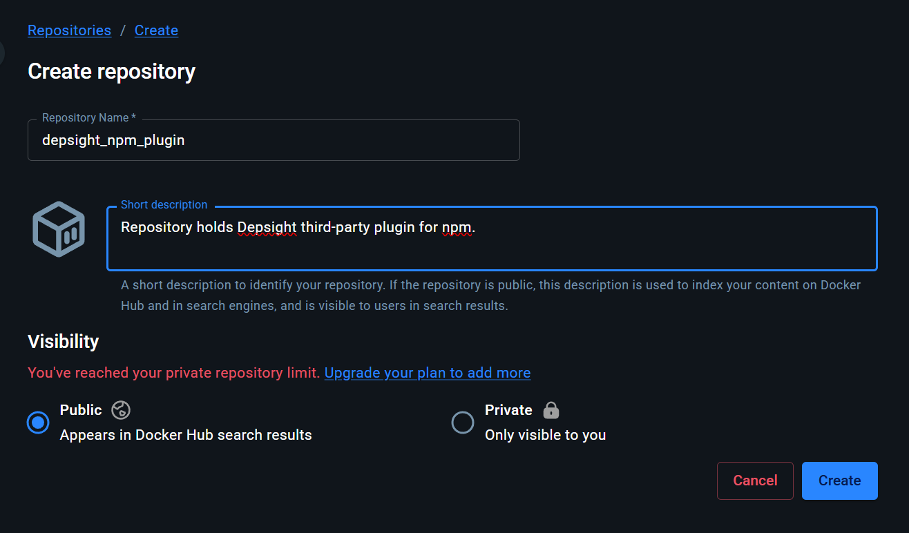

# Getting Started

## System Requirements

Before you begin, make sure the following tools are installed on your machine:

- **IDE with DevContainer support** — either of the following:
    - [Visual Studio Code](https://code.visualstudio.com/) with the [Dev Containers](https://marketplace.visualstudio.com/items?itemName=ms-vscode-remote.remote-containers) extension `RECOMMENDED`{ .tag-green }
    - [JetBrains Gateway](https://www.jetbrains.com/remote-development/gateway/) (supports Dev Containers via the Remote Development plugin)
- **Container manager** — any one of the following:
    - [Docker Desktop](https://www.docker.com/products/docker-desktop/) (macOS, Windows, Linux) `RECOMMENDED`{ .tag-green }
    - [Docker Engine](https://docs.docker.com/engine/install/) (Linux)
    - [Podman](https://podman.io/) with the Podman Desktop or CLI

## Set Up Repositories

### Set up Your GitHub Depsight NPM Plugin Repository

- Open the [deply-third-party-plugin](https://github.com/ValentinTwin1206/deply-third-party-plugin) template repository on GitHub
- Click **Use this template** → **Create a new repository**
- Set `deply-third-party-npm-plugin-solution` as the repository name and click **Create repository**
- Clone your new repository locally:

    ```bash
    git clone https://github.com/<your-username>/deply-third-party-npm-plugin-solution.git
    ```

### Set up Your Docker Depsight NPM Plugin Repository

- Navigate to [Docker Hub](https://hub.docker.com) and sign in
- Select **MyHub** in the top-level navigation menu
- Locate and click **Create repository**
- Give it a name (e.g., `depsight_npm_plugin`) and set the visibility to **Public**, then click **Create**

    

## Configure Your Docker Credentials

### Create a Personal Access Token (PAT)

- Navigate to the [Docker Hub login page](https://login.docker.com/u/login) and sign in with your credentials, or click **Sign Up** to create a new account
- Locate your user avatar in the top-right corner and navigate to **Account Settings**
- In the left-side navigation menu, click **Personal access tokens** and then **Generate new token**
- Specify a description, an expiration date, and grant it **Read, Write, Delete** permissions

    !!! warning "Save your token now"
        Copy the generated token and store it in a safe place immediately. Docker Hub will **never show it again** once you leave or reload the page.

- Open a terminal and run:

    ```bash
    docker login -u <your-docker-username>
    ```

    > Enter your **PAT** as the password when prompted
    
### Configure Your GitHub Secrets and Variables

- Navigate to your forked repository on GitHub and click **Settings** in the repository navigation bar
- In the left sidebar, expand **Secrets and variables** and click **Actions**
- Use the **New repository secret** button to add the following secret:

    | Secret Name | Description |
    |---|---|
    | `DOCKER_PAT` | Your Docker Hub Personal Access Token (created in the previous step) |

- Switch to the **Variables** tab and use **New repository variable** to add the following variables:

    | Variable Name | Description |
    |---|---|
    | `DOCKER_USERNAME` | Your Docker Hub username |
    | `DOCKER_REPOSITORY` | Your Docker Hub repository path (e.g., `yourusername/depsight-npm-plugin`) |

## Start the DevContainer

- Open a terminal, navigate to the cloned plugin repository, and open it in VS Code:

    ```bash
    cd deply-third-party-npm-plugin-solution && code .
    ```

- VS Code will detect the `.devcontainer` configuration and show a prompt in the bottom-right corner. Click **Reopen in Container** to build and start the DevContainer.

    

- With the [DevContainer environment set up](../getting-started/getting-started.md), `depsight` is available directly from the command line:

    

## Troubleshooting

### Cannot run `code .` inside WSL

If you are using **WSL** and the `code .` command fails, check whether Windows interoperability is disabled in your `/etc/wsl.conf`:

```ini
[interop]
enabled=false
```

Set `enabled=true` (or remove the entry) and restart your WSL session, then try again.