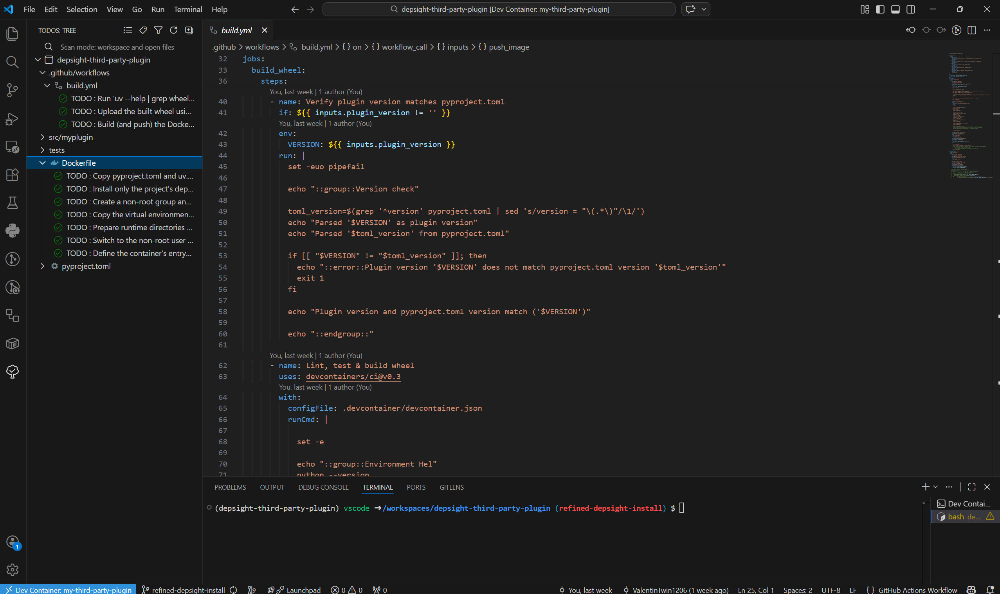
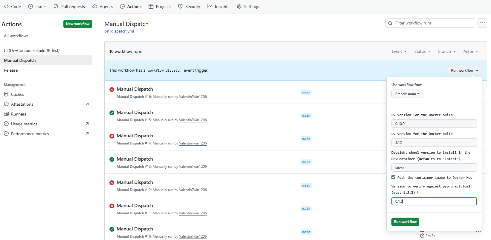

# Task 2: Package and Publish Your Plugin

## Task

With a working [plugin implementation](./task-1-write-a-npm-plugin.md) in place, your plugin is ready for packaging and distribution. Your next task is to produce a **Python wheel** and an **OCI container image** from your plugin. To do so, refine the provided `Dockerfile` and GitHub Actions workflow `build.yml`, push your changes to your GitHub remote, and trigger the workflow to build and publish both artifacts.

## Hints

### Prerequisites: Docker Hub Repository and Credentials

Before running the workflow, make sure you have [created a Docker Hub repository and configured your Docker credentials as GitHub Secrets and Variables](./../getting-started/getting-started.md#set-up-your-docker-depsight-npm-plugin-repository).

### Inline TODOs

The template repository already includes a `Dockerfile` and a GitHub Actions workflow script `build.yml`. Follow the inline `TODO` statements in both files to complete them. The expected outcome is a container image published to [DockerHub](https://hub.docker.com) and a Python wheel attached to a `1.0.0` release on your GitHub repository.

### Build and Push Image

#### Workflow Dispatch

The repository provides a manual trigger for testing the build without publishing. Use this to verify your `Dockerfile` and workflow configuration before creating a release. To trigger the *Workflow Dispatch*, navigate to the **Actions** tab in your GitHub repository, select the **Manual Dispatch** workflow, and click **Run workflow**. Set the version to match the one in `pyproject.toml` and leave the remaining inputs at their defaults.

#### GitHub Release

Once the build succeeds, create a GitHub release to push the image to Docker Hub and the wheel to the release assets:

- Set the `version` field in your `pyproject.toml` to `1.0.0`.
- Navigate to your repository on GitHub and click **Releases** in the right sidebar.
- Click **Draft a new release**.
- Click **Choose a tag**, type `1.0.0`, and select **Create new tag on publish**.
- Set the release title to `1.0.0`.
- Click **Publish release**.
